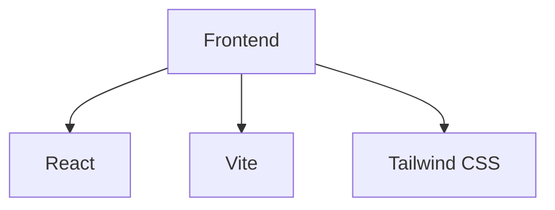

## 1. Architecture Design

## 2. Technology Description
- Frontend: React@18 + tailwindcss@3 + vite
- Initialization Tool: vite-init
- Backend: None
- Database: None

## 3. Route Definitions
| Route | Purpose |
|-------|---------|
| /login | 登录页面 |
| /register | 注册页面 |
| /forgot-password | 忘记密码页面 |
| /help/user-manual | 使用说明页面 |

## 4. API Definitions (if backend exists)
- 无后端
